<div align="center">

# Voctomix 2.0

**Full-HD software live video mixer, extended and containerized for reproducible remote production.**

[](https://github.com/martin1210235/voctomix-2.0/actions/workflows/ci.yml)


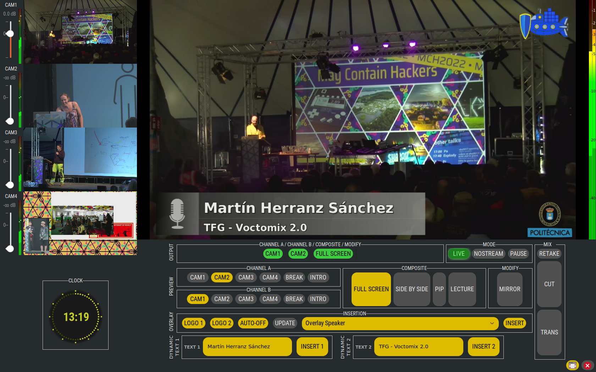

</div>

Voctomix 2.0 is an evolution of the open-source live video mixing system originally developed by [C3VOC](https://c3voc.de/). It preserves the original client-server architecture, a **voctocore** GStreamer processing engine and a **voctogui** GTK operator interface, and adds a set of production-oriented features together with a complete containerized deployment stack, validated across four real deployment scenarios: single PC, two PCs, Docker Compose and Kubernetes.

The system has been used within the **CyberNEMO** European research project at the Grupo de Aplicación de Telecomunicaciones Visuales (GATV), Universidad Politécnica de Madrid (UPM).

> **Academic context.** This repository contains the software developed for a Bachelor's Thesis (Trabajo Fin de Grado) in Telecommunication Engineering.
> - **Author:** Martín Herranz Sánchez
> - **Institution:** Escuela Técnica Superior de Ingenieros de Telecomunicación (ETSIT), Universidad Politécnica de Madrid (UPM)
> - **Research group / project:** GATV — CyberNEMO
> - **Academic year:** 2025–2026

---

## Table of Contents

- [Key Features](#key-features)
- [Architecture](#architecture)
- [Deployment Scenarios](#deployment-scenarios)
- [Prerequisites](#prerequisites)
- [Quick Start](#quick-start)
- [Documentation](#documentation)
- [Project Structure](#project-structure)
- [Port Reference](#port-reference)
- [Configuration](#configuration)
- [Telemetry](#telemetry)
- [Validation and Reproducibility](#validation-and-reproducibility)
- [Based On](#based-on)
- [Contributing](#contributing)
- [License](#license)

---

## Key Features

| Feature | Implementation |
|---|---|
| Stream Blanker (LIVE / PAUSE / NOSTREAM) | `voctocore/lib/streamblanker.py`, `voctogui/lib/toolbar/streamblank.py` |
| Dynamic on-air titling (lower-thirds) | `voctogui/lib/toolbar/overlay.py`, `voctogui/ui/` |
| Telemetry service | `voctogui/lib/gui_state_exporter.py`, `example-scripts/ffmpeg/telemetry_service.py` |
| Audio Follows Video (AFV) | `voctocore/lib/audiomix.py` |
| Auto-off overlays | `voctogui/lib/toolbar/overlay.py` |
| Full container deployment | `Dockerfile`, `docker-compose.yml`, `launch_docker_studio.sh`, `k8s/` |
| Intro / VTR pre-loaded sources | `example-scripts/ffmpeg/auto_launch_intro.sh` |

### Stream Blanker: LIVE / PAUSE / NOSTREAM

A three-state output control replaces the original binary on/off switch. The operator switches between a live program feed, a branded pause slate with background music, and a full offline screen, without stopping or restarting the pipeline.

<div align="center">

| PAUSE slate | NOSTREAM screen |
|:---:|:---:|
| 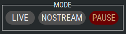 | 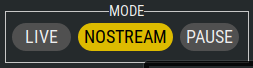 |

</div>

### Composite modes

Full-screen, picture-in-picture, side-by-side and lecture layouts, switchable live from the GUI:

<div align="center">
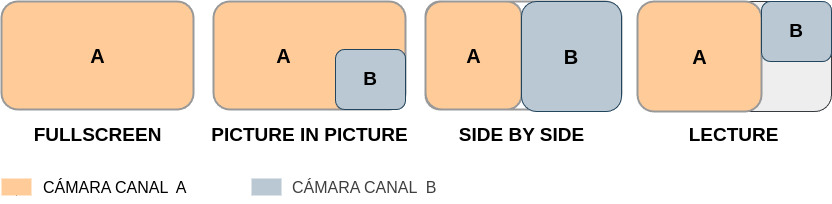
</div>

### Dynamic on-air titling
Two independent text layers (lower-thirds, speaker names, event titles) are typed in the GUI and composited directly over the live program in real time. Overlays and titles are dismissed automatically on every cut or composite change, preventing stale on-air graphics from carrying over.

### Audio Follows Video
When the operator switches the program source, the audio mix follows automatically: the outgoing source fades out and the incoming source fades in, with no manual action on the audio toolbar.

---

## Architecture

**voctocore** accepts incoming audio/video streams over TCP (Matroska container, raw I420 video plus PCM S16LE audio), mixes them through GStreamer's `compositor` element, and exposes the program output on TCP port 15000. It is driven by a line-based text-command interface on TCP port 9999. **voctogui** is a GTK client that connects to voctocore, renders live previews of every source and of the program mix, and provides the complete operator toolbar.

<div align="center">
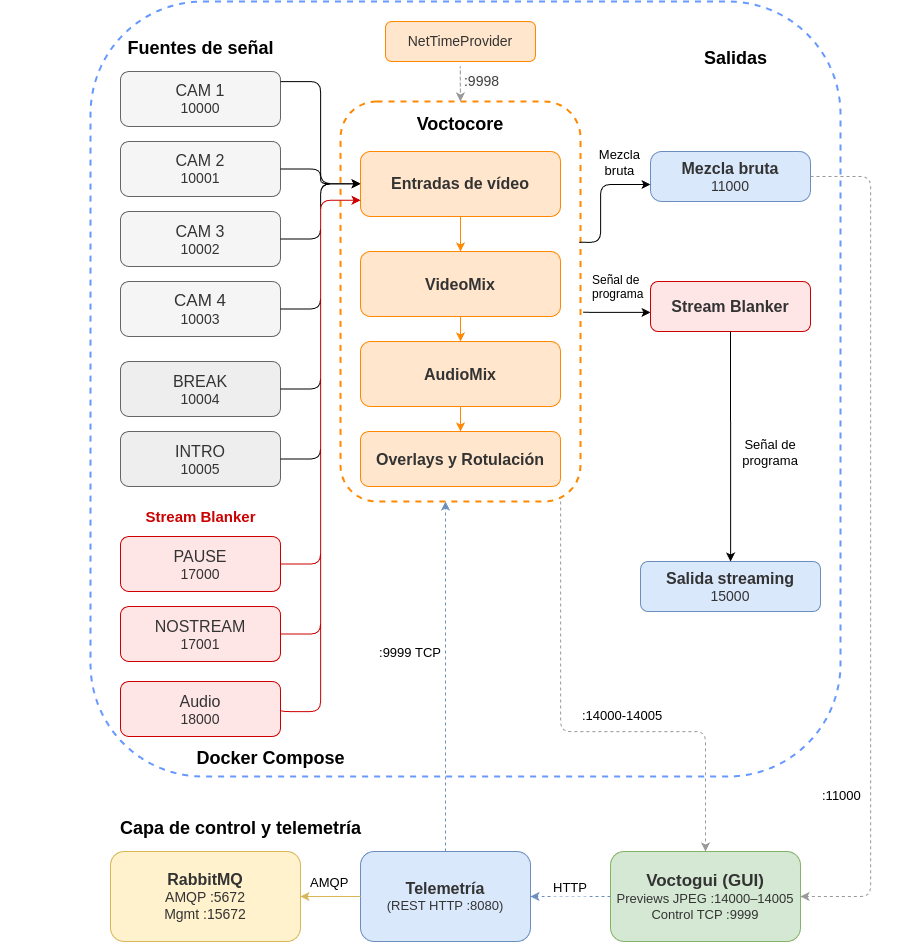
</div>

A detailed description of the GStreamer pipeline, modules and data flow is provided in [docs/ARCHITECTURE.md](docs/ARCHITECTURE.md).

---

## Deployment Scenarios

The same system was validated, without changes to the core code, across four deployments of increasing orchestration:

<div align="center">

| 1 — Single PC | 2 — Two PCs |
|:---:|:---:|
| 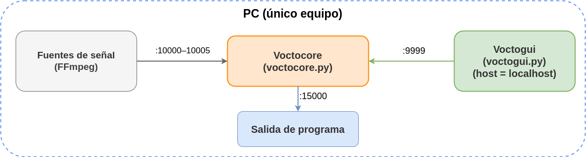 | 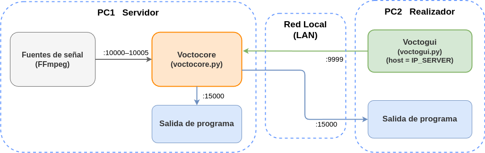 |
| **3 — Docker Compose** | **4 — Kubernetes** |
| 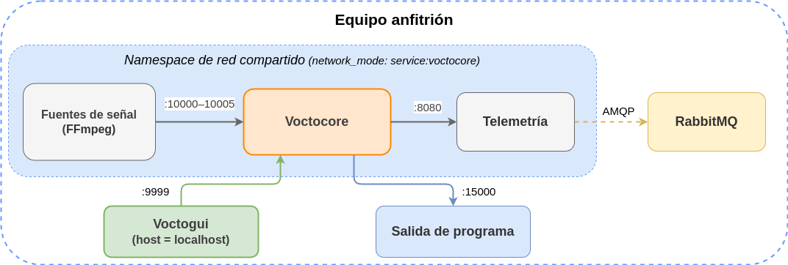 | 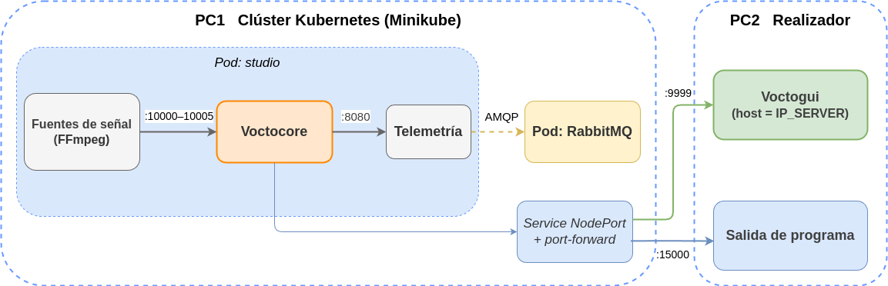 |

</div>

The full step-by-step walkthrough for each scenario is in [docs/DEPLOYMENT.md](docs/DEPLOYMENT.md).

---

## Prerequisites

### Native (Scenarios 1 and 2)

- **Operating system:** Ubuntu 22.04 LTS or Debian Bookworm
- **Python:** 3.10 or newer
- **GStreamer:** 1.20 or newer recommended

```bash
sudo apt install \
    python3 python3-gi python3-gi-cairo python3-scipy python3-numpy \
    gir1.2-gstreamer-1.0 gir1.2-gst-plugins-base-1.0 gir1.2-gtk-3.0 \
    gstreamer1.0-tools \
    gstreamer1.0-plugins-base gstreamer1.0-plugins-good \
    gstreamer1.0-plugins-bad gstreamer1.0-plugins-ugly gstreamer1.0-libav \
    ffmpeg netcat-openbsd iproute2

pip3 install pika==1.3.2
```

### Docker (Scenario 3)

- **Docker:** 24.0 or newer, with the **Compose plugin** v2.20 or newer (`docker compose`)
- A working **X11 display** on the host (voctogui runs natively, not in a container)

### Kubernetes (Scenario 4)

- **Minikube** with a working container runtime, and **kubectl** configured against the cluster

---

## Quick Start

```bash
git clone https://github.com/martin1210235/voctomix-2.0.git
cd voctomix-2.0
```

> Place the VTR assets in `videos/` before launching native, Docker or Kubernetes scenarios:
> `videos/intro.mp4`, `videos/SLIDES_video_starting_soon.mp4`,
> `videos/stream_offline.mp4`, `videos/musica_pausa.mp3`,
> `videos/video_cuenta_regresiva_10s.mp4`.

**Scenario 1 — Single PC (native).** Runs voctocore, all test sources, telemetry, a program monitor and voctogui on one machine:

```bash
./start_studio_single_pc.sh
```

**Scenario 2 — Two PCs (native).** PC 1 runs the core and sources; PC 2 runs the operator GUI:

```bash
./2pc_escenario2/start_voctocore_pc1.sh                 # PC 1 (server)
IP_SERVER=<IP_OF_PC1> ./2pc_escenario2/start_voctogui_pc2.sh   # PC 2 (operator)
```

**Scenario 3 — Docker (recommended).** One script builds the image, starts all services in order, waits for the health checks, then opens voctogui:

```bash
xhost +local:$(id -un)
./launch_docker_studio.sh
# stop: sudo docker compose down
```

**Scenario 4 — Kubernetes.** Orchestrated deployment on a local Minikube cluster:

```bash
cp k8s/secret.yaml.example k8s/secret.yaml
# edit k8s/secret.yaml and set RabbitMQ credentials
./k8s_escenario/start_server_pc1.sh     # PC 1 (server): minikube + manifests + port-forward
IP_SERVER=<IP_OF_PC1> ./k8s_escenario/start_operator_pc2.sh   # PC 2 (operator)
```

---

## Documentation

In-depth documentation is provided in [`docs/`](docs/):

| Document | Contents |
|---|---|
| [ARCHITECTURE.md](docs/ARCHITECTURE.md) | System architecture, GStreamer pipeline, modules, data flow |
| [CONTROL_PROTOCOL.md](docs/CONTROL_PROTOCOL.md) | TCP control protocol (port 9999), full command reference |
| [TELEMETRY.md](docs/TELEMETRY.md) | RabbitMQ AMQP chain, CHANGE/STATE events, JSON schema |
| [DEPLOYMENT.md](docs/DEPLOYMENT.md) | The four deployment scenarios, step by step |
| [CONFIGURATION.md](docs/CONFIGURATION.md) | `default-config.ini` reference |
| [TROUBLESHOOTING.md](docs/TROUBLESHOOTING.md) | Known issues and fixes |

---

## Project Structure

```
voctomix-2.0/
│
├── voctocore/                      # GStreamer mixer server (Python)
│   ├── voctocore.py                # Entry point
│   ├── default-config.ini          # Mix configuration (sources, caps, blanker)
│   └── lib/
│       ├── streamblanker.py        # LIVE/PAUSE/NOSTREAM pipeline
│       ├── audiomix.py             # Audio-Follows-Video logic
│       ├── videomix.py             # GStreamer compositor
│       ├── overlay.py              # Overlay image injection
│       ├── composites.py           # Composite definitions (fs, pip, sbs, lecture)
│       └── controlserver.py        # TCP control protocol (:9999)
│
├── voctogui/                       # GTK operator interface (Python)
│   ├── voctogui.py                 # Entry point
│   └── lib/
│       ├── gui_state_exporter.py   # Telemetry JSON exporter
│       └── toolbar/
│           ├── streamblank.py      # Stream status toolbar
│           └── overlay.py          # Dynamic titling and auto-off
│
├── vocto/                          # Shared library (composite command enum)
├── example-scripts/ffmpeg/         # Source injection and utility scripts
│
├── 1pc_escenario1/                 # Scenario 1: single-PC scripts
├── 2pc_escenario2/                 # Scenario 2: server + operator scripts
├── docker_escenario3/              # Scenario 3: Docker variant scripts
├── k8s/  ·  k8s_escenario/         # Scenario 4: Kubernetes manifests and scripts
│
├── images/                         # Overlay graphics and backgrounds
├── experiments/                    # Measurement scripts and raw logs (reproducibility)
├── tools/                          # Maintenance and release tooling
│
├── Dockerfile                      # Ubuntu 22.04 + GStreamer + FFmpeg + pika
├── docker-compose.yml              # Production stack
├── launch_docker_studio.sh         # Scenario 3: one-command Docker launcher
├── launch_k8s.sh                   # Scenario 4: Kubernetes launcher
├── start_studio_single_pc.sh       # Scenario 1: single-PC native launcher
├── .github/workflows/              # Continuous integration (pycodestyle lint)
└── docs/                           # Project documentation and assets
```

---

## Port Reference

| Port | Protocol | Direction | Description |
|------|----------|-----------|-------------|
| 9999 | TCP | → voctocore | Control protocol (text commands) |
| 9998 | UDP | broadcast | GStreamer `GstNetTimeProvider` (A/V sync clock) |
| 10000–10003 | TCP | → voctocore | Camera inputs cam1–cam4 (MKV / I420 + S16LE) |
| 10004 | TCP | → voctocore | Break / pause source |
| 10005 | TCP | → voctocore | Intro video source |
| 11000 | TCP | ← voctocore | Raw program mix (MKV / I420 + S16LE) |
| 12000 | TCP | ← voctocore | Mix preview (JPEG / MKV) |
| 13000–13005 | TCP | ← voctocore | Per-source recording outputs |
| 14000–14005 | TCP | ← voctocore | Per-source preview outputs (GUI) |
| 15000 | TCP | ← voctocore | Post-blanker program output (stream feed) |
| 8080 | HTTP | ← telemetry | GUI-state JSON endpoint |
| 5672 | AMQP | ↔ RabbitMQ | Message broker |
| 15672 | HTTP | ← RabbitMQ | RabbitMQ management web UI |

---

## Configuration

voctocore is configured through `voctocore/default-config.ini`. Key sections:

```ini
[mix]
sources = cam1,cam2,cam3,cam4,break,intro
videocaps = video/x-raw,format=I420,width=1920,height=1080,framerate=25/1,pixel-aspect-ratio=1/1,interlace-mode=progressive,colorimetry=bt709
audiocaps = audio/x-raw,format=S16LE,channels=2,layout=interleaved,rate=48000

[stream-blanker]
enabled = true
sources = pause,nostream   ; drives the PAUSE and NOSTREAM buttons in the GUI

[overlay]
path = ./images
auto-off = true
blend-time = 300           ; milliseconds for overlay fade in/out
```

Any value defined in the core configuration overrides the GUI's equivalent, keeping all connected GUI instances in sync. The full reference is in [docs/CONFIGURATION.md](docs/CONFIGURATION.md).

---

## Telemetry

Every second, `GuiStateExporter` publishes a full snapshot of the mixer state. In single-machine deployments it is written to `sessions/gui_state.json`; in containerized deployments it is delivered over HTTP POST to the telemetry service (port 8080), which publishes the events to a RabbitMQ broker over AMQP.

<div align="center">
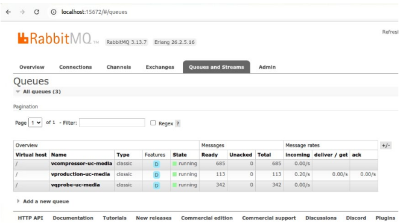
</div>

```json
{
  "last_update": "2026-04-22 14:35:01",
  "mode": "live",
  "composite": { "name": "full_screen", "fullscreen": true },
  "insertion": { "text1_active": true, "text1_value": "Speaker Name", "auto_off": true },
  "audio": { "cam1_db": -18.5, "cam2_db": -42.0 }
}
```

The complete AMQP event chain and JSON schema are documented in [docs/TELEMETRY.md](docs/TELEMETRY.md).

---

## Validation and Reproducibility

The system was validated across the four deployment scenarios. Resilience was measured as the median time for the program output to recover after an input source disconnects and reconnects:

| Deployment | Median program-recovery time |
|---|---|
| Docker Compose | ≈ 520 ms |
| Kubernetes (Minikube) | ≈ 570 ms |

The measurement scripts used to reproduce these figures are kept under [`experiments/`](experiments/). Selected result artifacts are kept under `sessions/` in the development repository; large runtime logs are not bundled in the public export by default. The complete experimental methodology and the full set of results are reported in the thesis.

<div align="center">
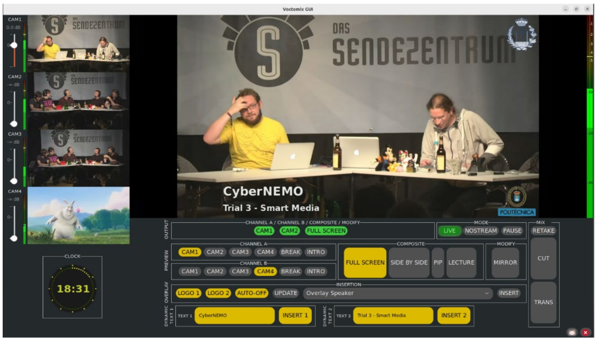
<br><em>Voctomix 2.0 in production during a CyberNEMO trial.</em>
</div>

---

## Based On

This project is a fork and extension of [voc/voctomix](https://github.com/voc/voctomix) (branch `voctomix2`), originally developed by the C3VOC team. The new features, the container and Kubernetes deployment, the launch scripts and this documentation were developed as part of a Bachelor's Thesis in Telecommunication Engineering (2025–2026).

---

## Contributing

Contributions are welcome. Please read [CONTRIBUTING.md](CONTRIBUTING.md) for the development setup, coding conventions (clean, modular, English-only code and comments), commit-message rules (Conventional Commits) and the test and lint workflow.

```bash
pip3 install -r requirements-dev.txt
sh voctocore/test.sh   # voctocore unit tests (mock GI bindings)
sh check_pep8.sh       # pycodestyle lint
```

For setup problems, see [docs/TROUBLESHOOTING.md](docs/TROUBLESHOOTING.md).

---

## License

Released under the [MIT License](LICENSE.txt).
