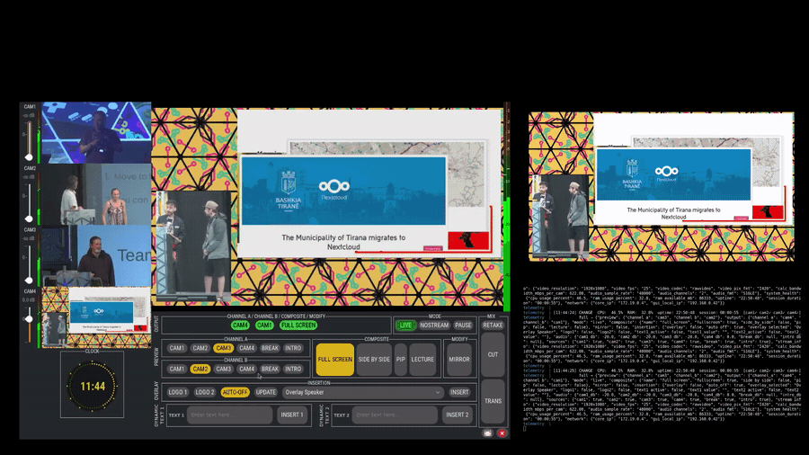

# Repo Playbook — Patrones de los repositorios top

> **Documento interno de trabajo.** No forma parte de la release pública (queda excluido por
> `tools/export_public.sh`). Es una base de conocimiento viva: vamos añadiendo lo que mejor
> funciona en los repos de software con más adopción, para que `voctomix-2.0` sea descargable,
> usable y atractivo. Marca con ✅ lo ya aplicado y con ⬜ lo pendiente.

---

## 1. La regla de los 30 segundos (lo más importante)

Una persona decide si tu repo merece la pena en **menos de 30 segundos**. El primer párrafo del
README debe responder a tres preguntas al instante:

1. **Qué es** (en una frase).
2. **Para quién es**.
3. **Por qué es diferente / mejor**.

> ✅ Aplicado: tagline + primer párrafo claros, hero visual arriba.

---

## 2. Anatomía de un README que convierte

Lo que se repite en casi todos los repos exitosos, en este orden:

1. **Título + tagline** de una línea.
2. **Una fila de 3-5 badges funcionales** (build, versión, licencia). Nunca badges de adorno
   ("made with love", "PRs welcome") que diluyen los útiles. ✅
3. **Hero visual**: captura, diagrama o, idealmente, un **GIF/vídeo de 30 s** mostrando el
   producto en acción. El GIF es el patrón nº1 que más convierte. ✅ captura · ⬜ GIF demo
4. **Descripción** (qué/para quién/por qué).
5. **Quick start** que funcione **a la primera** y en **< 5 minutos** con idealmente *un comando*. ✅
6. **Features** con capturas en cada sección, no solo texto. ✅
7. **Arquitectura** con diagrama a color. ✅
8. **Documentación** enlazada (no todo en el README). ✅
9. **Contributing / License**. ✅

**Consejo de oro:** el primer borrador suele sobrar un 40%. Cortar, cortar y que alguien lo lea
"en frío": si no sabe qué es en 30 s, no está terminado.

---

## 3. Visuales (lo que más impacto tiene)

- **Hero** arriba del todo: lo primero que se ve. ✅
- **GIF/vídeo demo** de 10-30 s del producto funcionando → duplica conversión. ⬜ *(recomendado:
  grabar la GUI cambiando de cámara, activando PAUSE/NOSTREAM y un overlay).*
- **Diagrama de arquitectura** a color. ✅
- **Galería** de capturas en tabla. ✅
- **"En producción"** / prueba social (logos de quién lo usa, foto real). ✅ (CyberNEMO)

---

## 4. Badges que sí aportan

Solo badges que comunican algo y enlazan a datos vivos:
- **build passing** (CI) → indica que hay integración continua. ⬜ *(enlazar el badge al workflow real)*
- **license** → ahorra una consulta legal. ✅
- **version / release** → si publicas releases. ⬜
- Lenguaje / stack (Python, GStreamer…). ✅

Tendencia 2026: **una sola fila de 3-4 badges**, todos funcionales.

---

## 5. Arranque en < 5 minutos

- El 95% de los repos exitosos se prueban en < 5 min con **un comando de instalar y uno de
  ejecutar**. ✅ (`./launch_docker_studio.sh`)
- Si aplica, un **"pruébalo en el navegador"** (Gitpod/Codespaces) duplica conversión. ⬜ *(menos
  relevante aquí por ser multimedia/GUI, pero un Codespace para revisar código es posible).*

---

## 6. Ficheros de salud de comunidad (los tienen todos los serios)

- `README.md` ✅
- `LICENSE` ✅
- `CONTRIBUTING.md` ✅
- `CODE_OF_CONDUCT.md` ✅ *(añadido)*
- `SECURITY.md` ✅ *(añadido)*
- `.github/ISSUE_TEMPLATE/` (bug + feature) ✅ *(añadido)*
- `.github/PULL_REQUEST_TEMPLATE.md` ✅ *(añadido)*
- `CHANGELOG.md` con cambios de cara al usuario ✅
- Etiquetas **`good first issue`** para atraer a quien empieza. ⬜ *(crear en GitHub)*

GitHub muestra un "Community Standards" check en cada repo; el objetivo es tenerlo **al 100%**.

---

## 7. Descubribilidad (que la gente te encuentre)

Acciones en GitHub (ajustes del repo, las haces tú en la web):
- ⬜ **Description** del repo: una línea clara con palabras clave.
- ⬜ **Topics**: `gstreamer`, `video-mixer`, `live-streaming`, `broadcasting`, `docker`,
  `kubernetes`, `python`, `rtmp`, `srt`, `voctomix`, `remote-production`, `gtk`.
- ⬜ **About → Website**: enlazar la documentación o la web del GATV.
- ⬜ **Social preview image** (Settings → General): subir el hero de la GUI; es la imagen que
  aparece al compartir el repo en redes.
- ⬜ **Pin** del repo en tu perfil de GitHub.
- ⬜ Entrar en una **awesome list** relevante (p. ej. awesome-streaming / awesome-video): puede
  dar 50-200 estrellas/mes en automático.

---

## 8. Releases y versionado

- ⬜ Publicar una **release `v2.0.0`** con notas (qué incluye, capturas). Las releases dan
  credibilidad y aparecen en el feed de GitHub.
- ⬜ Usar **tags semánticos** (`vMAJOR.MINOR.PATCH`).
- ✅ `CHANGELOG.md` mantenido.

---

## 9. Crecimiento y difusión (cuando quieras visibilidad)

- **Las primeras 100 estrellas** vienen de tu red: compañeros, GATV, UPM, LinkedIn.
- **Show HN** en Hacker News (mañanas de día laborable en horario EE. UU.) y subreddits relevantes
  (`r/VIDEOENGINEERING`, `r/selfhosted`, `r/ffmpeg`).
- **Demo en vídeo** al compartir: lo que más engancha.
- El crecimiento es **no lineal**: los picos vienen de HN, posts de blog y charlas.
- **Ayuda primero, promociona después**: responde issues en < 24 h (patrón nº1 de los que crecen).

---

## 10. Mantenimiento sostenido

- Releases periódicas anunciadas con vídeo/captura.
- Changelog centrado en mejoras de cara al usuario.
- Responder a cada issue (idealmente < 24 h).

---

## Checklist específico para voctomix-2.0

| Item | Estado |
|------|--------|
| README con hero, badges, quick start, diagramas, capturas | ✅ |
| Documentación en `docs/` | ✅ |
| CONTRIBUTING / LICENSE / CHANGELOG | ✅ |
| CODE_OF_CONDUCT / SECURITY / plantillas issue+PR | ✅ |
| GIF/vídeo demo de la GUI | ⬜ |
| Description + Topics + About en GitHub | ⬜ (web) |
| Social preview image (hero GUI) | ⬜ (web) |
| Release `v2.0.0` con notas | ⬜ |
| Etiqueta `good first issue` | ⬜ (web) |
| Repo fijado en el perfil | ⬜ (web) |

---

## Guion del GIF demo (pendiente de grabar)

Objetivo: 15-20 s, en bucle, mostrando el producto en acción. Va arriba del README como hero
(un GIF convierte más que una captura estática). Ruta reservada: `docs/assets/demo.gif`.

Secuencia a grabar (con la GUI en marcha):
1. (0-3 s) Vista general de la GUI, programa en FULL SCREEN, modo LIVE.
2. (3-7 s) Seleccionar CAM2 en Channel A y hacer CUT/TRANS → el programa cambia de cámara.
3. (7-12 s) Cambiar el composite a SIDE BY SIDE y luego PIP → se ve en directo.
4. (12-16 s) Escribir un nombre en TEXT 1 e INSERT 1 → aparece el rótulo inferior; al cortar,
   AUTO-OFF lo retira solo.
5. (16-20 s) Pulsar PAUSE (slate de pausa) → NOSTREAM (pantalla offline) → volver a LIVE.

Cómo grabarlo (Linux): **Peek**, **Byzanz** (`byzanz-record -d 18 demo.gif`) u **OBS** capturando la
ventana de voctogui. Exportar a ~900 px de ancho, < 5 MB, en bucle.

Snippet listo para incrustar como hero (sustituye o acompaña a la captura estática):
```html
<p align="center"></p>
```

> Estado: ⬜ pendiente de que el usuario grabe el GIF. Cuando lo tenga, se sube a
> `docs/assets/demo.gif` y se incrusta en el README (1 minuto, push por la integración).

---

## Fuentes
- awesome-readme (matiassingers) · Best-README-Template (othneildrew)
- "GitHub README Template: Complete 2026 Guide to Get More Stars" (DEV)
- "I Analyzed 50 GitHub Repos That Went From 0 to 10K Stars — 7 Patterns" (DEV)
- GitHub Community: Tips & Strategies to Grow Stars
