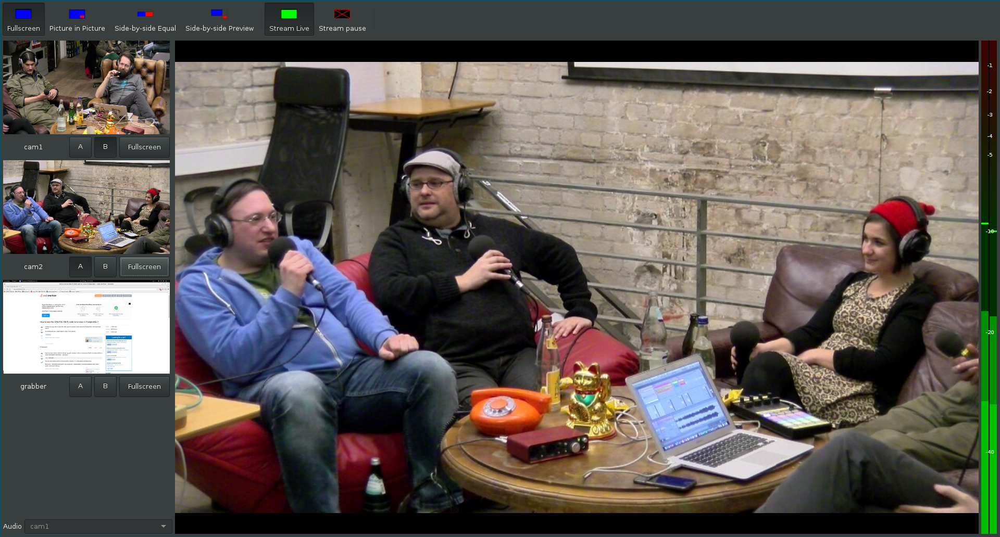

# Voctogui - The GUI frontend for Voctocore

## Keyboard Shortcuts
### Composition Modes
- `F5` Full Screen
- `F6` Side by Side
- `F7` Picture in Picture
- `F8` Lecture
- `F9` Mirror modifier

`F5` and `F6` are also assigned to `BREAK` and `INTRO` in the shipped
source-A toolbar configuration. If this is ambiguous on your GTK setup, adjust
the duplicate accelerators in `voctogui/default-config.ini`.

### Select A-Source
- `F1` CAM1
- `F2` CAM2
- `F3` CAM3
- `F4` CAM4
- `F5` BREAK
- `F6` INTRO

### Select B-Source
- `1` CAM1
- `2` CAM2
- …

### Stream Blanking
Stream blanking controls are exposed when configured by the deployment profile.

### Other options
- `Return` Cut
- `Space` Transition
- `Backspace` Retake

### Select an Audio-Source
Click twice on the selection combobox, then select your source within 5 Seconds. (It will auto-lock again after 5 seconds.)

## Configuration
On startup the GUI reads the following configuration files:
 - `<install-dir>/default-config.ini`
 - `<install-dir>/config.ini`
 - `/etc/voctomix/voctogui.ini`
 - `/etc/voctogui.ini`
 - `<homedir>/.voctogui.ini`
 - `<File specified on Command-Line via --ini-file>`

From top to bottom the individual settings override previous settings. `default-config.ini` should not be edited, because a missing setting will result in a Python exception.

On startup the GUI fetches all configuration settings from the core and merges them into the GUI config.
